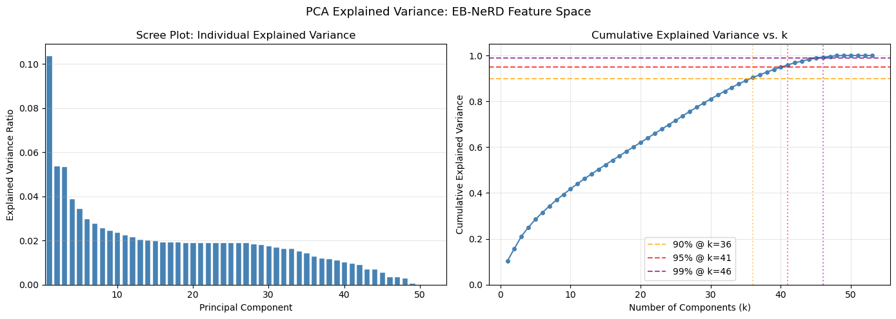
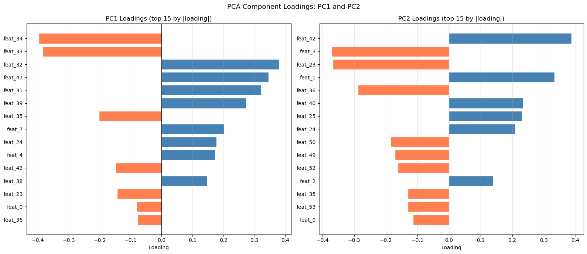
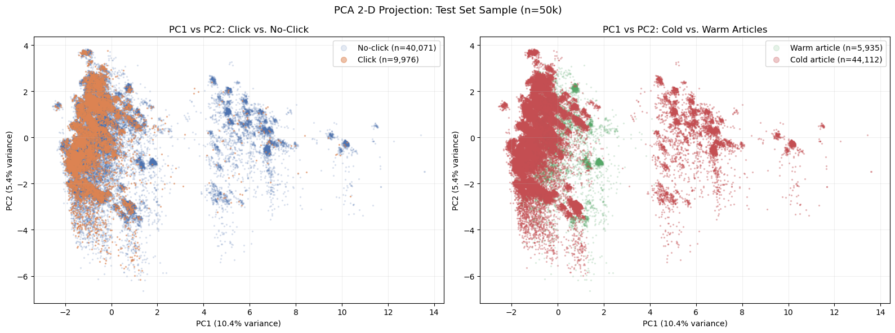
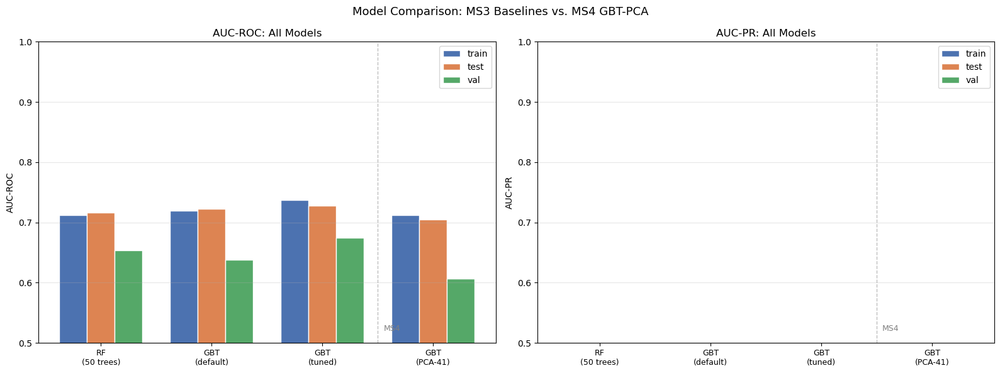
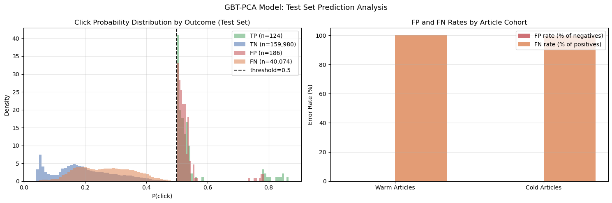

# EB-NeRD Click Prediction and Cold-Start Analysis

**DSC 232R: Big Data Technologies with Spark, Final Project**

This repository contains the complete final submission for a large-scale news recommendation project built on the EB-NeRD dataset. The work is organized as a sequence of milestone notebooks, but this README presents the project as one coherent report. It integrates the exploration work from MS2, the preprocessing and first model family from MS3, and the dimensionality-reduction experiment from MS4 into a single narrative.

## 1. Introduction to the Project

I chose this project because news recommendation is a practical machine learning problem with clear real-world importance. Every day, digital platforms decide which stories readers see first. A good predictive model can help surface more relevant articles, reduce how often unhelpful content is shown, and improve how quickly timely information reaches the right audience. That makes click prediction a useful case study in both machine learning and modern data systems.

This problem is also interesting because it combines several hard challenges at once. Reader behavior changes quickly over time. Article popularity shifts from hour to hour. Many articles are brand new and have little or no interaction history. That cold-start setting makes the problem harder because the model cannot rely only on prior clicks and instead has to learn from article metadata, user history, and short-term session signals.

The project genuinely required big data and distributed computing. The `ebnerd_large` dataset contains about 37.9 million impression logs, more than 1.1 million users, about 125 thousand articles, and more than 213 million historical interactions. After exploding impression rows into candidate article rows, the working table grows to roughly 440 million rows before negative downsampling. At that scale, standard single-machine workflows become impractical.

Spark made the project feasible because it could:

- explode in-view article arrays into hundreds of millions of candidate rows
- compute rolling 24-hour engagement features across large temporal partitions
- join several large parquet tables without turning the pipeline into a memory bottleneck
- rebuild a preprocessing pipeline over tens of millions of examples
- train PCA and tree-based models at realistic scale

Without Spark, I would have had to shrink the dataset or simplify the features so much that the project would no longer reflect the real structure of large-scale recommendation data.

## 2. Figures

The main figures for the project are stored as executed outputs inside the notebooks. The repository does not currently include separate PNG assets, so this section serves as the figure guide for the written report.

| Figure | Description | Location |
|---|---|---|
| Figure 1 | Data exploration visuals covering schema structure, missingness, impression patterns, click imbalance, and article metadata distributions | [MS2_Data_Exploration.ipynb](MS2_Data_Exploration.ipynb) |
| Figure 2 | Model diagnostics from the first distributed model family, including performance comparisons and feature-importance views | [MS3_Preprocessing_and_Modeling.ipynb](MS3_Preprocessing_and_Modeling.ipynb) |
| Figure 3 | PCA explained variance plot showing cumulative variance and the 90%, 95%, and 99% thresholds | [MS4_Dimensionality_Reduction_and_Modeling.ipynb](MS4_Dimensionality_Reduction_and_Modeling.ipynb) |
| Figure 4 | PC1 and PC2 loading plots used to interpret the principal components | [MS4_Dimensionality_Reduction_and_Modeling.ipynb](MS4_Dimensionality_Reduction_and_Modeling.ipynb) |
| Figure 5 | Two-dimensional PCA projection separating click labels and cold versus warm article cohorts | [MS4_Dimensionality_Reduction_and_Modeling.ipynb](MS4_Dimensionality_Reduction_and_Modeling.ipynb) |
| Figure 6 | AUC comparison chart for RF, default GBT, tuned GBT, and GBT on PCA features | [MS4_Dimensionality_Reduction_and_Modeling.ipynb](MS4_Dimensionality_Reduction_and_Modeling.ipynb) |
| Figure 7 | Prediction analysis plots showing probability distributions and false-positive / false-negative rates by cohort | [MS4_Dimensionality_Reduction_and_Modeling.ipynb](MS4_Dimensionality_Reduction_and_Modeling.ipynb) |

**Figure legends**

- **Figure 1. Data exploration.** These visuals established the size of the dataset, the imbalance in click labels, and the availability of article and behavior fields that could support cold-start modeling.
- **Figure 2. First-model diagnostics.** These plots summarize how the full-feature distributed models compare and which engineered features dominate the strongest model.
- **Figure 3. Explained variance.** The PCA scree and cumulative variance curves show that 41 components capture 95.91% of total variance from the 54-dimensional feature vector.
- **Figure 4. Component loadings.** The loading plots reveal that PC1 is mostly an article-engagement axis, while PC2 reflects user-depth and session-behavior structure.
- **Figure 5. PCA projection.** The two-dimensional projection shows how cold articles cluster toward the lower-engagement side of the reduced feature space.
- **Figure 6. Model comparison.** The bar chart places the final PCA-based model alongside the MS3 baselines on AUC-ROC and AUC-PR.
- **Figure 7. Prediction behavior.** These plots show how the final model distributes confidence and where errors concentrate across cold and warm cohorts.

The five MS4 visualizations below were exported from the saved notebook outputs and embedded directly in this report.

### Figure 3. PCA Explained Variance



### Figure 4. PCA Component Loadings



### Figure 5. PCA Two-Dimensional Projection



### Figure 6. Model Performance Comparison



### Figure 7. Prediction Analysis



## 3. Methods

This section summarizes the methods in the same order they were carried out during the project.

### 3.1 Data Exploration

The project began with exploratory analysis in [MS2_Data_Exploration.ipynb](MS2_Data_Exploration.ipynb). The purpose of this stage was to understand the scale of the dataset, inspect schemas, identify null-heavy fields, measure class imbalance, and see which article and behavior fields might be useful for modeling.

Main exploration steps:

- loaded parquet tables for behaviors, history, and articles with PySpark
- inspected schemas and representative records
- measured impression counts, click distributions, and article metadata patterns
- examined missing values and candidate fields for feature engineering

Representative code:

```python
df_behaviors = spark.read.parquet(behaviors_path)
df_articles = spark.read.parquet(articles_path)

df_behaviors.select("impression_id", "user_id", "article_ids_inview").show(5, truncate=False)
df_articles.select("article_id", "category_str", "sentiment_label").show(5, truncate=False)
```

### 3.2 Preprocessing with Spark

The preprocessing pipeline was built in [MS3_Preprocessing_and_Modeling.ipynb](MS3_Preprocessing_and_Modeling.ipynb) and reused in the final model notebook. The pipeline was designed to be time-aware so that no future information leaked backward into training features.

Main preprocessing steps:

- exploded each impression into candidate article rows
- applied negative downsampling with `npratio = 4` while preserving all positives
- split the training behavior data temporally into train and test subsets
- created rolling 24-hour CTR and popularity features from historical activity only
- joined article metadata, user-history summaries, session signals, and a cold-start indicator
- fit a Spark MLlib pipeline using `StringIndexer`, `OneHotEncoder`, `Imputer`, `VectorAssembler`, and `StandardScaler`

Representative code:

```python
preprocessing_pipeline = Pipeline(stages=[
    StringIndexer(inputCols=index_cols, outputCols=index_out_cols, handleInvalid="keep"),
    OneHotEncoder(inputCols=ohe_in_cols, outputCols=ohe_out_cols, handleInvalid="keep"),
    Imputer(inputCols=num_cols, outputCols=num_cols),
    VectorAssembler(inputCols=assembler_inputs, outputCol="assembled", handleInvalid="keep"),
    StandardScaler(inputCol="assembled", outputCol="features", withMean=False, withStd=True),
])
```

### 3.3 Model 1: First Distributed Model

The first modeling stage used the full engineered feature space and was implemented in [MS3_Preprocessing_and_Modeling.ipynb](MS3_Preprocessing_and_Modeling.ipynb). Three distributed tree models were trained and compared.

Models trained:

- Random Forest with 50 trees and maximum depth 8
- default Gradient-Boosted Trees
- tuned Gradient-Boosted Trees with `maxIter=50`, `maxDepth=7`, `stepSize=0.05`, `subsamplingRate=0.7`, `featureSubsetStrategy="sqrt"`, and `minInstancesPerNode=5`

Representative code:

```python
gbt_tuned = GBTClassifier(
    labelCol="label",
    featuresCol="features",
    maxIter=50,
    maxDepth=7,
    stepSize=0.05,
    subsamplingRate=0.7,
    featureSubsetStrategy="sqrt",
    minInstancesPerNode=5,
    seed=42,
)
```

### 3.4 Model 2: PCA + Supervised Model

The final model was developed in [MS4_Dimensionality_Reduction_and_Modeling.ipynb](MS4_Dimensionality_Reduction_and_Modeling.ipynb). This notebook reused the MS3 preprocessing pipeline, cleaned NaN values inside feature vectors before PCA, fit PCA on the training split only, selected a 95% explained-variance cutoff, and then trained a second GBT model on the reduced features.

Main steps:

- rebuilt train, test, and validation feature tables with the saved MS3 pipeline
- replaced NaN values inside feature vectors before PCA
- fit full-rank PCA to inspect the variance spectrum
- selected `k = 41`, which captured 95.91% of the variance from the 54-dimensional feature vector
- trained GBT on `pca_features` using the same hyperparameters as the tuned full-feature model

Representative code:

```python
pca_model = PCA(k=41, inputCol="features", outputCol="pca_features")
pca_fitted = pca_model.fit(df_train_prep)

gbt_pca = GBTClassifier(
    labelCol="label",
    featuresCol="pca_features",
    maxIter=50,
    maxDepth=7,
    stepSize=0.05,
    subsamplingRate=0.7,
    featureSubsetStrategy="sqrt",
    minInstancesPerNode=5,
    seed=42,
)
```

### 3.5 Execution Environment

All large-scale experiments were run on SDSC Expanse using one 16 CPU, 128 GB node with PySpark `local[15]`, 96 GB driver memory, 800 shuffle partitions, scratch-backed local storage, disabled broadcast joins, and checkpointing to control lineage depth.

## 4. Results

This section reports the outputs of the methods without interpretation.

### 4.1 Data Exploration Results

- dataset bundle used: `ebnerd_large`
- impression logs: about 37.9 million
- users: about 1.1 million
- articles: about 125 thousand
- historical interactions: about 213 million
- exploded candidate table: about 440 million rows before downsampling

The exploration stage also showed strong label imbalance and confirmed that article age and recent interaction signals would likely matter for prediction.

### 4.2 Preprocessing Results

- negative downsampling preserved all positives and sampled negatives within impression groups at a 4:1 ratio
- temporal splitting used the first 80% of the timeline for training and the last 20% for testing
- the final standardized full-feature vector had 54 dimensions
- the cold-start cohort was defined as articles with age less than or equal to 24 hours or zero total inviews

### 4.3 Model 1 Results

| Model | Train AUC-ROC | Test AUC-ROC | Val AUC-ROC | Train AUC-PR | Test AUC-PR | Val AUC-PR |
|---|---|---|---|---|---|---|
| RF (50 trees, depth 8) | 0.7123 | 0.7164 | 0.6538 | 0.2621 | 0.2649 | 0.2803 |
| GBT default (20 rounds, lr=0.1) | 0.7200 | 0.7226 | 0.6378 | 0.2698 | 0.2712 | 0.2709 |
| GBT tuned (50 rounds, lr=0.05) | 0.7375 | 0.7281 | 0.6749 | 0.2901 | 0.2876 | 0.2984 |

Cold-start breakdown for the tuned GBT on the test split:

| Cohort | N | AUC-ROC |
|---|---|---|
| Warm articles | 2,838,845 | 0.7129 |
| Cold articles | 20,801,887 | 0.6930 |

### 4.4 Model 2 Results

PCA summary:

| Metric | Value |
|---|---|
| Full feature dimension | 54 |
| Full-rank PCA components recovered | 53 |
| 90% variance threshold | 36 |
| 95% variance threshold | 41 |
| 99% variance threshold | 46 |
| Selected k | 41 |
| Variance captured at k=41 | 95.91% |
| Compression ratio | 54 to 41 |

Final GBT-PCA results:

| Model | Train AUC-ROC | Test AUC-ROC | Val AUC-ROC | Train AUC-PR | Test AUC-PR | Val AUC-PR |
|---|---|---|---|---|---|---|
| GBT on PCA-41 features | 0.7127 | 0.7047 | 0.6067 | 0.3581 | 0.3343 | 0.2488 |

Cold-start breakdown for GBT-PCA on the test split:

| Cohort | N | AUC-ROC |
|---|---|---|
| Warm articles | 2,838,845 | 0.6780 |
| Cold articles | 20,801,887 | 0.6800 |

The final notebook also includes confusion-matrix summaries, sample predictions, probability histograms, explained-variance plots, PCA loading plots, and false-positive / false-negative rate comparisons by cohort.

## 5. Discussion

The project progressed in a way that felt honest to the data. MS2 made it clear that the challenge was not just training a classifier. The harder part was building a defensible pipeline at the right scale and preserving temporal logic so that the results meant something. Once the candidate table reached hundreds of millions of rows, engineering decisions and scientific decisions became tightly linked.

The strongest result from the first model family was that recent engagement matters a lot. In the full-feature models, `rolling_popularity_24h` emerged as the most important feature by a wide margin. That is believable in a real news environment. Readers respond strongly to current relevance, visibility, and momentum, so it makes sense that short-term popularity carries major predictive value.

The cold-start result is also believable. The tuned GBT produced the best validation performance overall, but cold articles still trailed warm ones on the test split. That matches the structure of the problem. New articles simply have less behavioral evidence behind them, so the model has to fall back on weaker signals such as category, sentiment, text-derived counts, and user-history summaries.

The final model was useful because it revealed a real tradeoff rather than a superficial improvement. On the test split, GBT-PCA stayed reasonably close to the tuned full-feature baseline, which suggests that PCA preserved the strongest high-variance structure in the feature space. On validation, however, the drop was much steeper. That result is important because it suggests the compressed space lost lower-variance signals that still helped with generalization across time. In this case, PCA made the feature space cleaner and more interpretable, but it did not produce the strongest final predictor.

One especially interesting outcome is that PCA almost removed the cold-versus-warm AUC gap. That does not mean the PCA model was better overall. Instead, it suggests that the reduced representation leaned less heavily on the engagement-history signals that mainly benefit warm articles. In practical terms, the model became more even across cohorts while also becoming weaker in total discrimination.

There are several limitations worth stating clearly.

- The project uses engineered metadata and interaction summaries rather than dense semantic embeddings.
- The evaluation focuses on binary classification metrics rather than a full ranking objective.
- PCA is unsupervised, so it optimizes for variance retention rather than class separation.
- Temporal shift remains a real challenge across all models.
- The report figures live in notebook outputs rather than separate image files in the repository.
- The MS2 and MS3 visuals are still easiest to view in the notebooks themselves, while the MS4 visuals are now embedded directly in this README.

Overall, the results look believable. They are not too good to trust, they expose meaningful failure modes, and they line up with what we would expect in a recommendation problem driven heavily by short-term engagement.

## 6. Conclusion

This project showed that large-scale click prediction is as much a data-engineering problem as a modeling problem. The strongest model was still the tuned GBT on the full 54-dimensional feature set, with validation AUC-ROC of 0.6749. The PCA-based final model was still valuable because it exposed the structure of the feature space, gave a clearer picture of the cold-start geometry, and showed an important tradeoff between compactness, interpretability, and generalization.

The main thing I learned about big-data processing is that distributed computing changes what kinds of questions you can ask. Spark made it possible to preserve temporal logic, compute rolling engagement features correctly, and train models on a realistic candidate table rather than a drastically simplified sample. That changed both the ambition and the credibility of the project.

With more time and resources, I would explore three directions first:

1. add semantic article embeddings to improve cold-start performance
2. evaluate ranking metrics and recommendation-style objectives rather than only binary classification metrics
3. test supervised dimensionality reduction or hybrid models that preserve rare but useful category signals

The broader lesson is that infrastructure matters. Better compute and better data pipelines did not just make the code run faster. They made it possible to study the recommendation problem in a more realistic and more scientifically useful way.

## 7. Statement of Collaboration

Name: David Salcido  
Title: Sole Project Author  
Contribution: Designed the project, carried out the exploration, built the Spark preprocessing pipeline, trained and evaluated both modeling stages, interpreted the results, wrote the notebooks, and prepared the final report independently.

## Repository Contents

- [MS2_Data_Exploration.ipynb](MS2_Data_Exploration.ipynb): exploratory analysis of the EB-NeRD dataset
- [MS3_Preprocessing_and_Modeling.ipynb](MS3_Preprocessing_and_Modeling.ipynb): Spark preprocessing pipeline and the first distributed model family
- [MS4_Dimensionality_Reduction_and_Modeling.ipynb](MS4_Dimensionality_Reduction_and_Modeling.ipynb): PCA analysis, second model, and prediction diagnostics
- [expanse_setup.sh](expanse_setup.sh): SDSC Expanse setup notes


